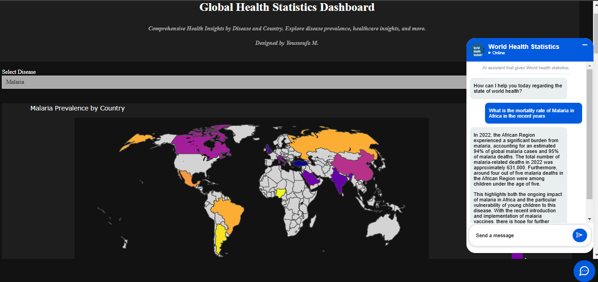
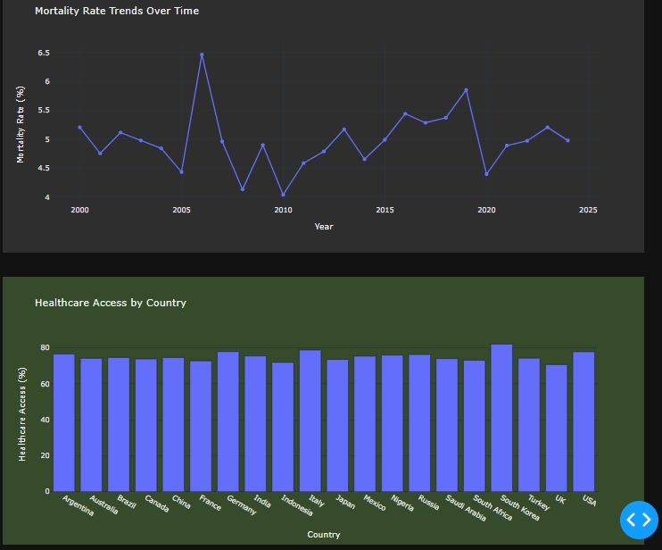
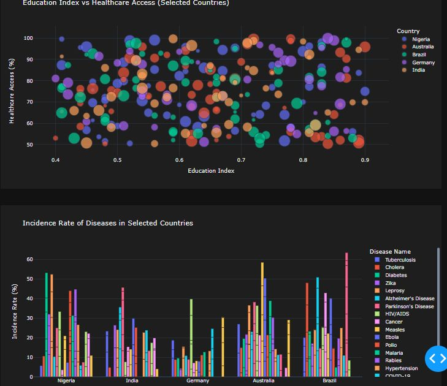

# 🌍 Global Health Statistics Dashboard 
## Enhanced with an AI-powered assistant to quickly retrieve relevant insights



### 📊 Overview  
The **Global Health Statistics Dashboard** is an interactive web application that visualizes health data across various countries and diseases. This dashboard provides insights into disease prevalence, mortality rates, healthcare access, and more.  
Built using **Dash, Plotly, and Pandas**, the dashboard enables users to explore comprehensive health metrics with interactive graphs and dropdowns. 

Enhanced with a Chatbot Integration, users can interact with an AI-powered assistant to quickly retrieve relevant insights and answer questions about global health statistics, making the dashboard even more user-friendly and resourceful.





---

### 🚀 Features  
- **Global Disease Prevalence Map** – Choropleth map showing disease prevalence by country over time.  
- **Top 10 Deadliest Diseases** – Visualize the diseases with the highest mortality rates.  
- **Mortality Rate Trends** – Track mortality rate changes over the years.  
- **Healthcare Access by Country** – Compare healthcare access levels across nations.  
- **Recovery Rate vs Treatment Cost** – Scatter plot showing cost vs recovery for major diseases.  
- **Education Index vs Healthcare Access** – Analyze the relationship between education and healthcare availability.  
- **Incidence Rate by Disease** – Grouped bar chart of disease incidence rates in selected countries.  
- **Dynamic Dropdown** – Select specific diseases to filter the data and view tailored visualizations.
- **AI Chatbot Integration** – Ask questions about global health statistics and receive instant answers powered by AI.

---

### 📂 Project Structure  
- 📄 GHS_Dashbord_AIAgent.py # Main Dash application file
- 📊 GHS1.xlsx # Health statistics dataset
- 📄 requirements.txt # Python dependencies
- 📜 index.html # Embeds the chatbot alongside the dashboard
- 📜 README.md # Project documentation

---

### ⚙️ Setup and Installation  

1. **Clone the Repository**  
```bash
git clone https://github.com/your-repo-name.git
cd your-repo-name
```

3. **Install Dependencies**
pip install -r requirements.txt

4. **Run the Dashboard**
- python GHS_Dashbord_AIAgent.py
- Visit http://127.0.0.1:8050/ in your browser to interact with the dashboard.
- Explore Chatbot Features: Interact with the AI chatbot embedded in the dashboard for personalized assistance.

### 👨‍💻 Author
- Youssoufa M.
- 🔗 LinkedIn Profile: https://www.linkedin.com/in/usufcom/
